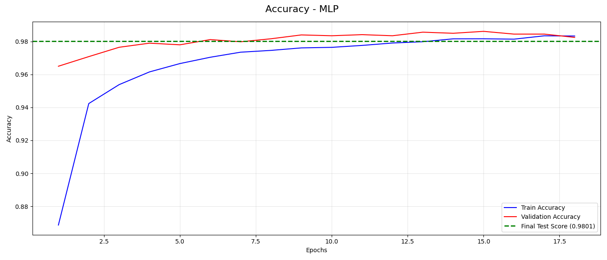
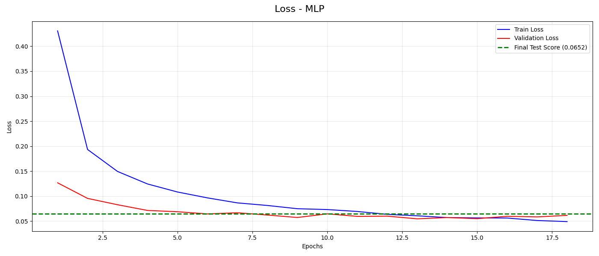
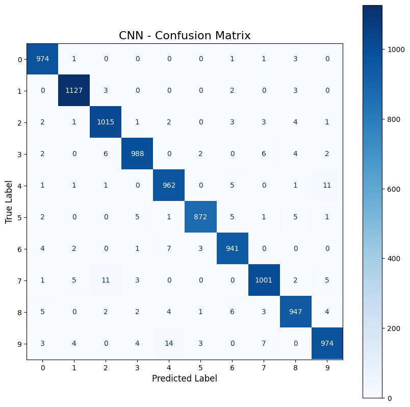
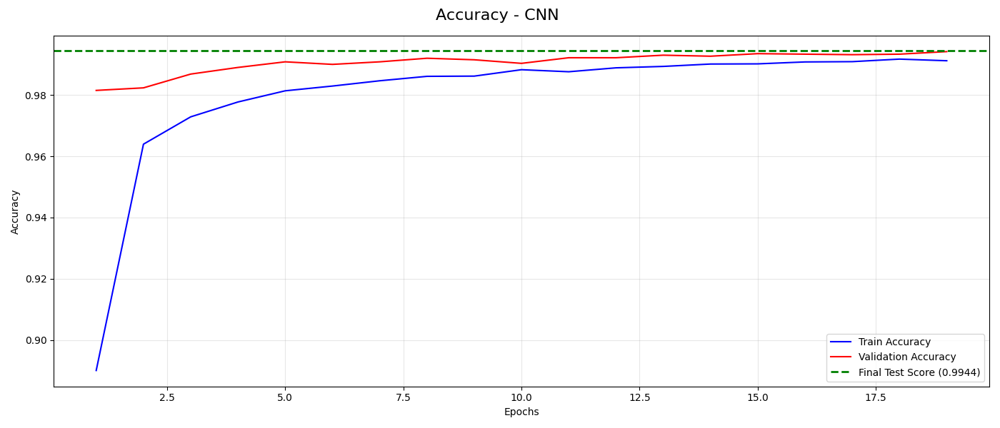
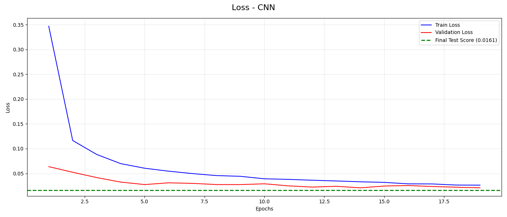
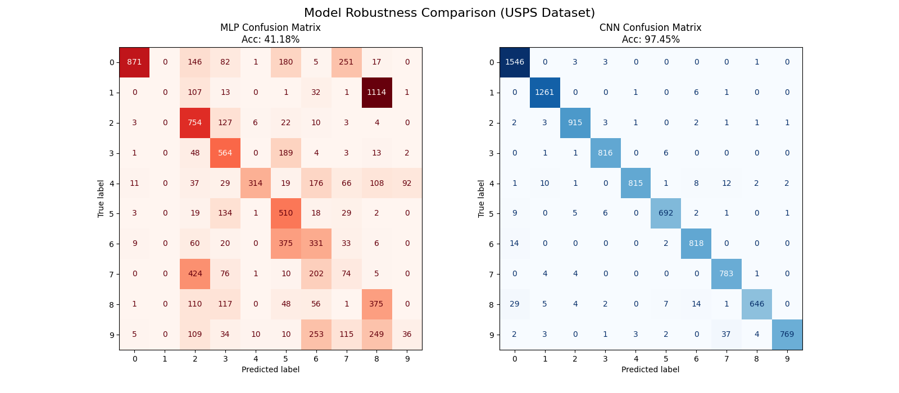

# Handwritten Digit Classification - MLP vs. CNN

## Project Overview
This project investigates the chanllenges of building and training an Artificial Neural Network for classifying handwritten digits. In particular, the project focuses on the differences between the classic Fully Connected Neural Network, the Multilayer Perceptron (MLP), and more advanced Deep Neural Networks, such as a Convolutional Neural Network (CNN).

Both neural networks were trained using the same data (MNIST dataset) and then tested in a completely new domain (USPS dataset). The end goal of the project is to understand how and why deep neural networks excell at this type of classification problems, and why 'shallower' neural networks struggle. Although, it should be theoretically possible to approximate any continuous function using a "simple" three layer ANN.

---
## Data
This project uses the **MNIST dataset** of handwritten digits to train both neural networks.
* **Source:** [The MNIST Database](http://yann.lecun.com/exdb/mnist/)
* **Authors:** Yann LeCun, Corinna Cortes, Christopher J.C. Burges
* **Details:** The dataset contains 70,000 images divided into 60,000 training examples and 10,000 testing examples.

<div align="center">
  
</div>

In addition, both models are evaluated in with an external dataset to test how well both networks generalize the data.
* **Source:** [USPS Database](https://ieeexplore.ieee.org/document/291440/authors#authors)
* **Authors:** J. J. Hull
* **Details:** The dataset contains 9,298 images divided into 7,291 training examples and 2,007 testing examples

---
## Components
### 1. Multilayer Perceptron (MLP)

**- What is a Multilayer Perceptron?**

An MLP is a type of Feed Forward Network consiting of no more than 3 layers, one input layer, one or two hidden layers, and one output layer. Each layer has a set of Linear Threshold Units (neurons) that are interconnected by links, and each link has an associated connection weight. In addtion, each layer has a single Bias unit that is connected to all the units in the subsecuent layer. In theory, any three layer MLP should be a "Universal Approximator", meaning it is capable of modelling any non linear function arbitrarly well.

**- MLP Architecture**

The architecture of the MLP for this task consists of 3 layers. One input layer with 784 (28x28) nodes, followed by two hidden layers: the first with 224 nodes and the next with 288 nodes. Finally, an output layer made out of 10 nodes representing each number from 0 to 9.

In order to make the network more robust and less prone to overfitting a dropout rate of 40% was chosen for both hidden layers. The dropout rate is a regularization method that "deactivates" a proportion of neurons, 40% in this case", to add noise to the training process and prevent co-adaptation of layers. Moreover, both hidden layers use a ReLU activation function, since it is the most common transfer fucntion because of its simplicity and ability to mitigate the vanishing gradient problem during training.

As mentioned in the beginning the output layer consists of 10 neurons, one for each number from 0 to 9. The activation function in this layer is the Softmax which assings a probability to each neuron. The neuron with the highest probability determines the model predicted number.

*Architecture Flow:*

Input (784) → Dense(224) → Dense(288) → Dense(10)
<div align="center">

| Layer | Type | Output Shape | Parameters |
|-------|------|-------------|------------|
| dense | Dense (224 units) | (224) | 175,840 |
| activation | ReLU | (224) | 0 |
| dropout | Dropout | (224) | 0 |
| dense_1 | Dense (288 units) | (288) | 64,800 |
| activation_1 | ReLU | (288) | 0 |
| dropout_1 | Dropout | (288) | 0 |
| dense_2 | Dense (10 units) | (10) | 2,890 |
| activation_2 | Softmax | (10) | 0 |

</div>
**Total Parameters:** 243,530  

**- Training**

The training process of the MLP was done in different stages.

**Hyperparameter Tunning:** first the framework 'KerasTuner' was used to apply a Random Search algorithm to find the most optimal set of hyperparameters. The 'tuner' was programmed to search:
* Number of nodes in each hidden layer (32 - 512)
* Dropout rate for each hidden layer (0.0 - 0.5)
* Learning Rate (0.01, 0.001, 0.0001)

After 10 iteration the best hyperparameters where:
* Units in first hidden layer = 224
* Units in second hidden layer = 288
* Dropout rate = 0.4
* Learining rate = 0.001

**Model Training:** once the optimal set of hyperparameters was identified, the MLP was retrained to optimize the weights using the ADAM (Adaptive Moment Estimator) optimizer. 

During this final phase, the full training dataset (60,000 images) was utilized, with 10% automatically reserved for validation to monitor performance. The training was set to 30 epochs, but an early stopping mechanism was introduced to halt the process if the validation loss stalled for five consecutive epochs, thervy conserving computation resources and preventing overfitting. Additionally, a batch size of 128 samples was selected to balance trainin speed with gradient stability.

The results of the model in the training and validation sets weere:

<div align="center">

| Dataset | Loss | Accuracy |
| :--- | :---: | :---: |
| **Training** | 0.0213 | 99.42% |
| **Validation** | 0.0234 | 99.40% |

</div>

<table width="100%">
  <tr>
    <th align="center">Accuracy</th>
    <th align="center">Loss</th>
  </tr>
  <tr>
    <td align="center">
      
    </td>
    <td align="center">
      
    </td>
  </tr>
</table>

The trained MLP converges in an accuracy of aproximately 99% that was achieved after a sharp increase in the initial epochs, indicating that the model quickly identified the fundamental features of the digits. Moreover, the validation line tracks down the training line, which indicates that the model is nos overfitting. Otherwise, while the training accuracy increses, the validation accuracy would start to drop off.

The same structured can be observed in the loss plot, where the validation loss remains extremely close to the training loss throughout the process. In addition, the fact both curves flatten out together indicates that the dropout rate and early stopping mechanism prevented the network to memorize the data.

**- Performance**

To evaluate the performance of the trained MLP with "unseen" data the network is executed using the held-out test set, comparing the predicted labels against the actual digits. 

The MLP achieved an accuracy of 98%, correctly classified 9,800 out of 10,000 images. The confusion matrix provided a more in-depth analysis of which digits the model struggled with the most. The most frequent errors involved the number 2 (misclassified by a 7) and the number 4 (misclassified by a 9). Since these pairs share significant morphological similarities, these missclasifications are expected limitation of a simple MLP.

<div align="center">

| Dataset | Loss | Accuracy |
| :--- | :---: | :---: |
| **Test** | 0.0652 | 98.01% |

</div>


<div align="center">
  
</div>

 
### 2. Convolutional Neural Network (CNN)
**- What is a Convolutional Neural Network?**

A CNN is a specialized type of Deep Neural Network (ANN with more than 3 layers) designed to process data with grid-like topology, such as images. Unlike traditional fully connected networks (such as the MLP), CNNs are capable of recognize pattern (like edges or shapes) regardles of where they appear in the image. This is known as translation invariant or location tolerant.

This property allows CNNs to learn the underlying hierarchical stucture of visual inputs and build complex features from simple ones. To achieve this, these networks have a convolutional layer that uses "parameter sharing", meaning that instead of assignig weights to every pixel, a small matrix of weights (kernel) slides accross the entire input prforming a cross-correlation operation

$$
Y(i,j) = (X * H) = \sum_{k,l} X(i+k, j+l) H(k,l)
$$

CNNs posseses a more complex architecture than standard MLPs, as their initial hidden layers are meant to find the patterns in the data with tolerance to location, before passing the processed data to a fully connected feedforward neural network. It is common practice in modern acrchitectures to stack multiple sequences of convolutional and pooling layers.
* Convolutional Layer: this is the core of CNNs. The objective of this layer is to find the hidden patterns with tolerance to location. The output of this layer is a feature map
* Pooling Layer: after the convolutional layer it is common practice to use a pooling layer. This part of the network is responsible of increasing the networks translation invariance by reducing the feature maps with a single summary statistic (mean or maximum value).
* Fully Connected Layer: this layer works as an MLP. In this part the classification process is executed.

**- CNN Architecture**

Input → Conv2D(32) → MaxPool → Conv2D(192) → MaxPool → Dense(128) → Dense(10)

<div align="center">

| Layer | Type | Output Shape | Parameters |
|-------|------|-------------|------------|
| conv2d | Conv2D | (28, 28, 32) | 320 |
| max_pooling2d | MaxPooling2D | (14, 14, 32) | 0 |
| conv2d_1 | Conv2D | (14, 14, 192) | 55,488 |
| max_pooling2d_1 | MaxPooling2D | (7, 7, 192) | 0 |
| flatten | Flatten | (9,408) | 0 |
| dense | Dense (ReLU) | (128) | 1,204,352 |
| dropout | Dropout | (128) | 0 |
| dense_1 | Dense (Softmax) | (10) | 1,290 |

</div>


**Total Parameters:** 1,261,450


**- Training**


The results of the model in the training and validation sets weere:

<div align="center">

| Dataset | Loss | Accuracy |
| :--- | :---: | :---: |
| **Training** | 0.0104 | 99.68% |
| **Validation** | 0.0210 | 99.27% |

</div>


<table width="100%">
  <tr>
    <th align="center">Accuracy</th>
    <th align="center">Loss</th>
  </tr>
  <tr>
    <td align="center">
      
    </td>
    <td align="center">
      
    </td>
  </tr>
</table>


**- Performance**

<div align="center">

| Dataset | Loss | Accuracy |
| :--- | :---: | :---: |
| **Test** | 0.0161 | 99.44% |

</div>

<div align="center">
  
</div>

---
## Performance in new domain
<div align="center">
  
</div>

---

## Installation & Setup

Follow the steps below to run the project locally.

### 1. Clone the Repository

```bash
git clone https://github.com/PedroGiu13/MNIST---Neural-Network.git
cd MNIST---Neural-Network
```

### 2. Create and Activate a Virtual Environment

**Windows**
```bash
python -m venv venv
venv\Scripts\activate
```

**macOS / Linux**
```bash
python3 -m venv venv
source venv/bin/activate
```

### 3. Install Dependencies

```bash
pip install -r requirements.txt
```

## Requirements

- tensorflow==2.20.0  
- keras==3.13.2  
- keras-tuner==1.4.8  
- scikit-learn==1.8.0  
- numpy==2.4.2  
- matplotlib==3.10.8  
- opencv-python==4.13.0.92  


## Usage

### Train the MLP Model

```bash
python src/MLP.py
```

### Train the CNN Model

```bash
python src/CNN.py
```

### Evaluate on unseen USPS Data

```bash
python src/test_usps.py
```
